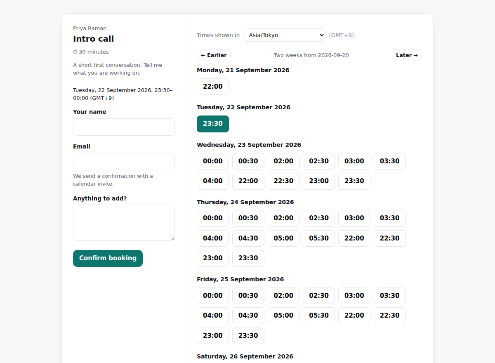

# Slotline

A booking page. You publish your weekly hours once, in your own timezone;
visitors see them in theirs and pick a slot. Confirmations go out with a real
calendar invite attached.

**[Run it in one command](#running-it)** — the demo account seeds itself with
availability, two meeting types and a few bookings, and the landing page signs
you into it with one click.



---

## The hard part

There are two, and they are the reason this is a more interesting project than
its CRUD surface suggests.

### 1. Timezones are not an offset

The naive model — store a number of minutes, add the user's UTC offset — breaks
the first time the clocks change. Slotline's rule is:

> **An instant is stored in UTC. A rule is stored as wall-clock time plus an
> IANA zone. They are different kinds of thing and never mix.**

"Tuesdays, 09:00–17:00" is not a fixed span of UTC. In New York it is
13:00–21:00Z for half the year and 14:00–22:00Z for the other half. So the
conversion happens **per day**, through the zone, not once with a cached
offset:

```ts
// src/timezone.ts — no date library, just Intl
const naive = Date.UTC(y, m - 1, d, hour, minute);
let instant = new Date(naive - offsetMinutesAt(new Date(naive), zone) * 60000);
instant = new Date(naive - offsetMinutesAt(instant, zone) * 60000);   // correct the guess
```

Two passes, because the offset you need depends on the instant you are trying
to compute. Then comes the part most implementations skip — **the round-trip
check**:

```ts
if (toWallTime(instant, zone) !== wall) return null;  // that wall time does not exist
```

On 8 March 2026 New York goes straight from 01:59 to 03:00. There is no 02:30.
A naive converter silently returns 01:30 or 03:30 and offers a meeting at a
time that never happens; Slotline returns `null` and the slot is not offered.
Going the other way, on 1 November 01:30 happens *twice*, and the converter
resolves it to the first occurrence rather than producing two bookable slots an
hour apart that both claim to be "01:30".

`test/timezone.test.ts` and `test/availability.test.ts` pin all of this down:
spring-forward gaps, autumn ambiguity, southern-hemisphere DST running the
other way, Kathmandu's 45-minute offset, and a viewer whose *date* differs from
the host's — a Tokyo visitor books "Tuesday 04:00" and the host sees "Monday
15:00". Same instant, different day, both correct.

### 2. Two people booking the same slot, one second apart

The obvious implementation is:

```ts
const taken = await isSlotTaken(start);   // ← another request gets here too
if (!taken) await insertBooking(start);   // ← and both insert
```

That is a read-then-write race, and it does not need a pathological workload to
happen — two people clicking the last Tuesday slot a few hundred milliseconds
apart is enough. No amount of application-level checking closes it, because the
gap is *between* the check and the write, and a second process cannot see your
uncommitted intent.

So the guarantee lives in the schema:

```sql
EXCLUDE USING gist (
  host_id WITH =,
  tstzrange(starts_at, ends_at) WITH &&
) WHERE (status = 'confirmed')
```

Postgres now refuses to *store* two overlapping confirmed bookings for one
host, no matter how many application processes are racing. The insert fails
with SQLSTATE `23P01`, which the service turns into a friendly "someone just
booked that time". Three details worth noting:

- It is an **overlap** check, not an equality check, so a 60-minute booking
  blocks the 30-minute slot that starts halfway through it.
- Ranges are half-open, so back-to-back bookings (10:00–10:30 and 10:30–11:00)
  are fine — they touch but do not overlap.
- The `WHERE status = 'confirmed'` clause means cancelling genuinely frees the
  slot, without deleting the record.

The application still re-checks availability before inserting, but for a
different reason: to give a better error, and to stop a hand-crafted POST
booking 3am. The *correctness* comes from the constraint. `test/booking.test.ts`
proves the difference by firing ten concurrent `createBooking` calls at one slot
(exactly one survives), and then going around the service entirely with two raw
concurrent `INSERT`s to show that the constraint alone is what stops it.

### A smaller one: the calendar invite

`.ics` is hand-written in `src/ics.ts` — about 60 lines — because the fiddly
parts are worth seeing: CRLF line endings, folding at **75 octets** without
splitting a multi-byte character, escaping commas and semicolons, and a stable
`UID` with an incrementing `SEQUENCE` so that cancelling **removes** the meeting
from the invitee's calendar instead of adding a second, contradictory entry.

## Pages

| Route | What it is |
|---|---|
| `/` | Landing, with one-click demo login |
| `/app` | The host's bookings, upcoming and past |
| `/app/availability` | Weekly hours, timezone, meeting types, days off |
| `/:host` | Public profile listing meeting types |
| `/:host/:event` | The booking page — slots in the visitor's zone |
| `/booking/:token` | Confirmation, `.ics` download, cancellation |

## Stack

Node 22, TypeScript, Express, EJS, Postgres 16 (raw SQL, no ORM), Resend for
email. No date library, no frontend framework — the booking flow is
server-rendered forms, and the only client-side JavaScript detects the
visitor's timezone and highlights the slot they picked.

**Without a `RESEND_API_KEY` the app still works end to end**: confirmations are
printed to the console instead of sent. A demo that requires SMTP credentials
is a demo nobody runs.

## Running it

```bash
docker compose up          # http://localhost:3000, demo account seeded
```

Or against your own Postgres:

```bash
cp .env.example .env
npm install
npm run migrate && npm run seed
npm run dev
```

Demo credentials: `demo@slotline.dev` / `demo-password` (or just press the
button on the landing page).

## Tests

```bash
createdb slotline_test
echo "DATABASE_URL=postgres://localhost:5432/slotline_test" > .env.test
npm test
```

43 tests. The pure ones (timezones, slot generation, iCalendar) run in
milliseconds; the booking ones run real concurrent transactions against real
Postgres, because a double-booking test that does not actually race proves
nothing.

## Deploying

One click on Render — there is a `render.yaml` that creates the database and
the web service together. Railway and Fly.io instructions are in
[DEPLOY.md](DEPLOY.md).

The app boots with nothing but `DATABASE_URL`: migrations run on startup and
the demo data seeds itself, so a fresh deploy has something to look at
straight away.

Migrations run on boot. `btree_gist` — needed for the exclusion constraint — is
created by the first migration and ships with Fly, Railway, Supabase and RDS.

## Shortcuts taken

- **One host per account.** No teams, no round-robin, no shared calendars.
- **No external calendar sync.** Slotline knows about bookings made through
  Slotline; it will happily offer a slot you filled in Google Calendar. Real
  free/busy sync is the obvious next feature and a much larger one.
- **No rescheduling** — cancel and rebook.
- **Sessions are database rows** with a 30-day expiry and no rotation.
- **One availability window per weekday in the UI**, though the schema and the
  slot generator handle several (a lunch break renders correctly if you insert
  the rows directly).

## Licence

MIT
